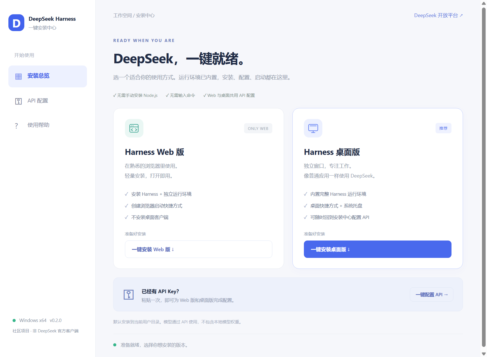
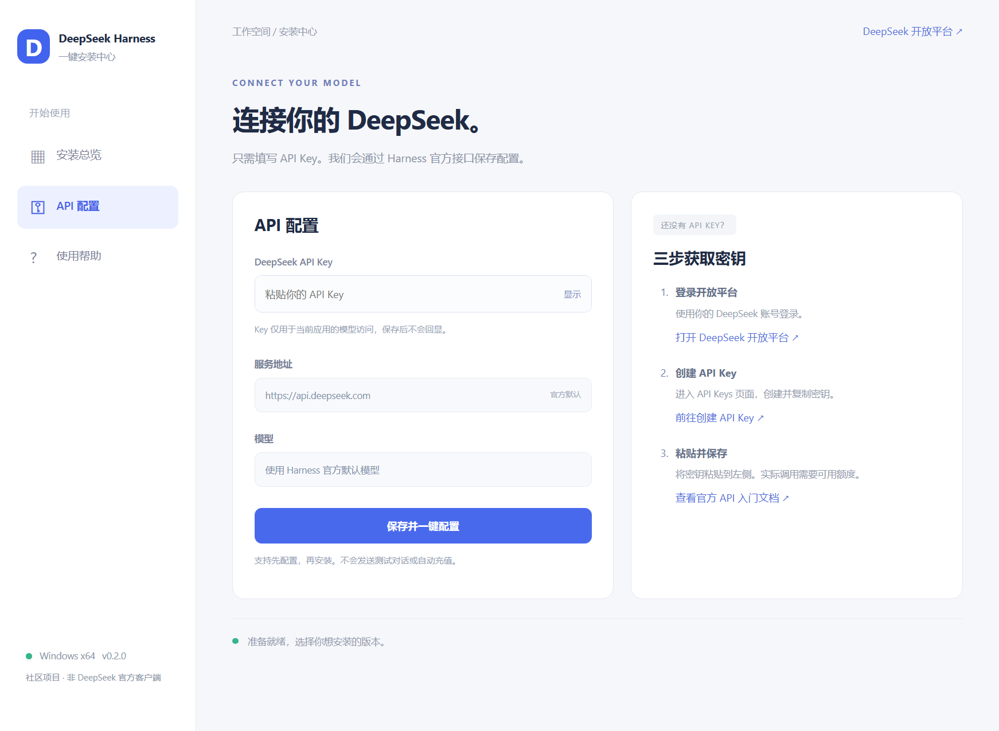
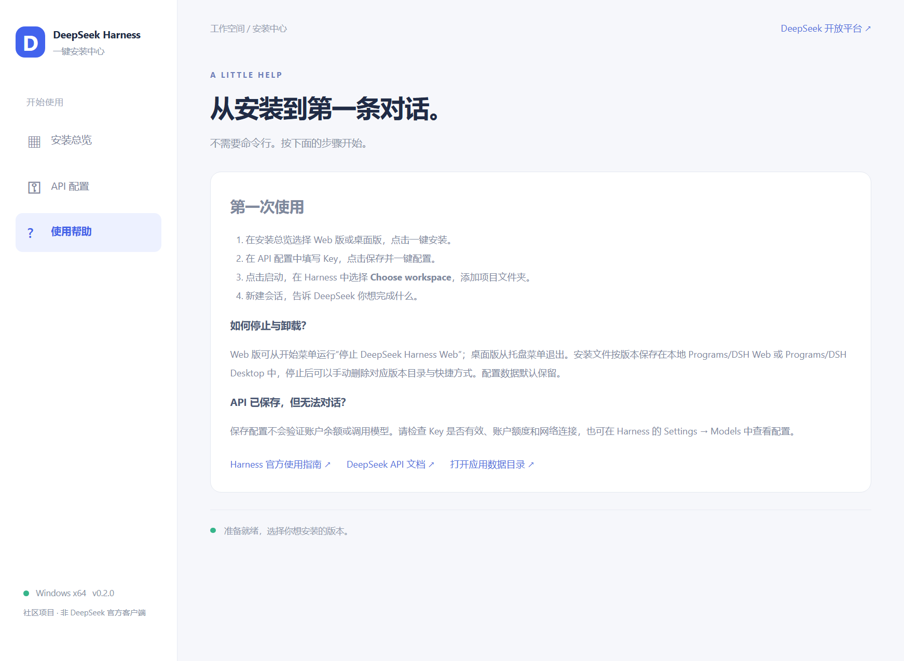
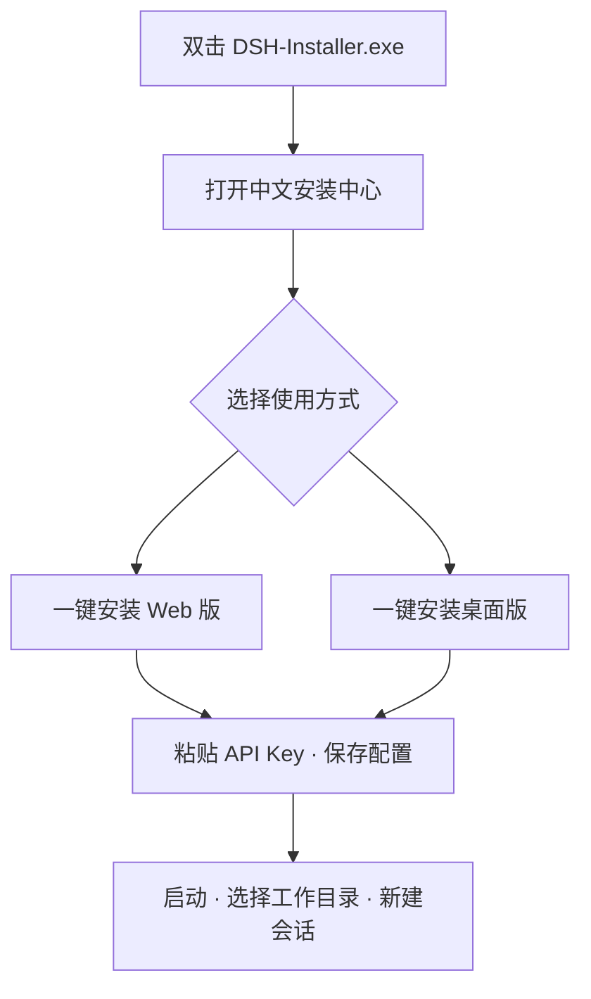

# DSH Desktop · DeepSeek Harness 一键安装中心

**打开安装包，选择 Web 或桌面版，粘贴 API Key，即可开始使用。**

面向 Windows 用户的中文图形化安装工具，内置 Node.js、npm、官方 DeepSeek Harness 和前端资源，无需手动准备开发环境或输入安装命令。

[获取安装包](#获取安装包) · [界面预览](#界面预览) · [开始使用](#开始使用) · [开发与构建](#开发与构建) · [DeepSeek 开放平台](https://platform.deepseek.com/)

> 独立社区项目，与 DeepSeek AI 无隶属或背书关系。支持 **Windows 10/11 x64**；模型通过 API 使用，需要自行提供 API Key，不包含本地模型权重。



## 可以做什么

| 功能 | 使用体验 |
| --- | --- |
| 一键安装 Web 版 | 安装独立 Harness 运行环境，通过快捷方式在浏览器中打开 |
| 一键安装桌面版 | 安装独立桌面窗口，支持快捷方式、系统托盘和服务重启 |
| 一键配置 API | 在 GUI 中粘贴 Key，通过 Harness 官方本地接口保存，Web 与桌面共用 |
| 获取 Key 的直达入口 | 一键打开 DeepSeek 开放平台、API Keys 页面和中文官方文档 |
| 安装进度与启动入口 | 显示当前步骤，安装完成后直接点击启动；重复安装可修复快捷方式 |
| 独立运行环境 | 无需全局安装 Node.js/Harness，不修改系统 PATH，不覆盖已有 CLI 配置 |

## 获取安装包

本 README 对应 **0.2.0 安装中心**。请下载文件名为 **`DSH-Installer-<版本>-x64.exe`** 的 Windows 安装包。

- **正式版本：** 到 [GitHub Releases](https://github.com/CuiLikun/dsh-desktop/releases) 下载安装包及 `SHA256SUMS.txt`。
- **最新构建：** 到 [CI 工作流](https://github.com/CuiLikun/dsh-desktop/actions/workflows/ci.yml)，打开对应提交的成功构建，在 **Artifacts** 中下载 `DSH-Desktop-Windows-x64`，解压后运行其中的 exe。下载工作流附件通常需要登录 GitHub。

**若 Releases 仍只有 v0.1.0，请从 Actions 获取新版构建。v0.1.0 不包含这里展示的 GUI 安装中心。** GitHub 的 “Source code” 压缩包是开发源码，不是可双击运行的安装包。

双击主安装包会先解压并打开安装中心，**点击安装按钮后**才会复制对应版本并创建快捷方式。安装所需文件已内置；模型调用与额外添加的插件需要网络。Git、Python 等具体项目工具按项目要求另行准备。

## 界面预览

以下图片来自实际 Electron 界面，以空白配置生成，不含真实 API Key 或用户会话。

### API 配置

粘贴 Key 后点击“保存并一键配置”。右侧提供登录平台、创建 Key 和查看官方文档的操作指引。



### 使用帮助

从第一条对话到停止服务、卸载和排查 API 配置问题，都可以在安装中心查看。



## 开始使用



1. **安装：** 选择 Web 版或桌面版，等待界面提示安装完成。
2. **配置：** 打开“API 配置”，粘贴自己的 Key，点击“保存并一键配置”。也可以先配置、后安装。
3. **启动：** 返回安装总览，点击“打开 Web 版”或“启动桌面版”。
4. **开始工作：** 在 Harness 中点击 **Choose workspace**，添加项目文件夹，然后新建会话。

### Web 版和桌面版怎么选

| 对比项 | Harness Web 版 | Harness 桌面版 |
| --- | --- | --- |
| 使用窗口 | 默认浏览器 | 独立应用窗口 |
| 安装内容 | Harness + Node.js/npm + 启动入口 | 完整运行环境 + 桌面客户端 |
| 桌面快捷方式 | DeepSeek Harness Web | DSH Desktop |
| 再次打开 | 打开已有的 Web 服务 | 恢复桌面窗口 |
| 停止服务 | 开始菜单 → 停止 DeepSeek Harness Web | 托盘菜单 → 退出 |
| 修改 API | 重新打开安装中心或使用 Harness 设置 | 应用菜单 → 安装中心 / 配置 API |
| 配置与会话 | 两种版本共用独立的 Harness 数据目录 | 两种版本共用独立的 Harness 数据目录 |

只想在浏览器使用就选 Web 版；希望有独立窗口和托盘入口就选桌面版。两者可以同时安装。

## 获取与配置 API Key

- [DeepSeek 开放平台](https://platform.deepseek.com/)：登录账号。
- [API Keys 管理页](https://platform.deepseek.com/api_keys)：创建并复制自己的 Key。
- [中文官方 API 入门文档](https://api-docs.deepseek.com/zh-cn/)：查看 API 使用方式和说明。

安装中心通过本机 Harness 的官方 credentials 接口保存 Key，采用官方默认的 DeepSeek 服务地址和模型。Key 不放入启动参数或诊断日志，保存成功后清空输入框。高级设置仍可在 Harness 的 **Settings → Models** 中调整。

**“已保存”表示本地配置已写入，并不代表 Key 或账户额度已在线验证。** 安装中心不会发送测试对话或自动充值。若无法对话，请检查 Key、账户额度、网络连接以及是否已选择工作目录。

## 安装位置与数据

| 内容 | 默认位置 |
| --- | --- |
| Web 版安装文件 | `%LOCALAPPDATA%/Programs/DSH Web/<版本>` |
| 桌面版安装文件 | `%LOCALAPPDATA%/Programs/DSH Desktop/<版本>` |
| 共享配置、凭据和会话 | `%APPDATA%/DSH Desktop/harness` |
| 初始空白工作目录 | `%APPDATA%/DSH Desktop/workspace` |
| 安装中心窗口缓存 | `%APPDATA%/DSH Installer` |

应用不会自动导入或覆盖原命令行 Harness 的 `~/.dsh`，也不复用系统环境变量中的 `DEEPSEEK_API_KEY`。已有 CLI 用户需在安装中心重新填写 Key。运行时的 PATH 和 DSH_HOME 只对子进程生效。

这是当前用户目录内的文件安装，**不注册系统卸载程序**。卸载时先停止对应服务，再删除对应版本目录和快捷方式。配置数据默认保留，彻底清理前请备份会话。升级后快捷方式指向新版，旧版文件可在停止使用后手动移除。

## 常见问题

**关闭桌面窗口后为什么服务还在运行？**

桌面版会驻留系统托盘。请从托盘菜单选择“退出”，结束它启动的服务。

**3080 端口被占用怎么办？**

默认会在 3081–3100 中选择空闲端口。桌面版也支持 `--port=3081` 或进程环境变量 `DSH_DESKTOP_PORT`；指定的端口被占用时会明确报错。

**以前已经配置过 Harness，为什么还要填写 Key？**

安装中心使用独立数据目录，保留原有 CLI 环境。重新填写一次后，安装中心管理的 Web 版和桌面版即可共用。

**下载了源码，为什么不能直接安装？**

源码需要开发环境和构建步骤。普通用户请下载 `DSH-Installer-<版本>-x64.exe`。

## 开发与构建

开发者需要 **Windows x64 和 Node.js 24**：

```powershell
npm.cmd ci
npm.cmd run prepare:runtime
npm.cmd start
```

源码启动默认显示安装中心预览，安装操作仅在打包后的应用中开放。

### 测试与打包

```powershell
npm.cmd run lint
npm.cmd test
npm.cmd run test:runtime
npm.cmd run test:gui
npm.cmd run dist
npm.cmd run test:gui -- --packaged
npm.cmd run test:runtime -- dist/win-unpacked/resources/runtime
```

主要产物为：

```text
dist/
├── DSH-Installer-0.2.0-x64.exe   # 先显示 GUI，再选择安装方式
├── SHA256SUMS.txt              # SHA256 校验文件
└── win-unpacked/               # 解包后的应用，用于验证
```

构建只生成文件，不执行安装程序。额外的 `dist:nsis` 是传统桌面安装器，普通用户应使用上述主安装包。

### 测试与图片更新

安装测试只向仓库内的临时目录复制样本文件；GUI 测试使用隐藏窗口与模拟操作；配置集成测试通过真实 Harness 保存、检查并删除假 Key，不发送模型请求。

运行 `npm.cmd run test:gui` 会在 `.test-data/gui/` 生成三张界面截图。更新 README 配图时，将 `installer.png`、`api.png`、`help.png` 分别复制到 `docs/images/installer.png`、`docs/images/api-setup.png`、`docs/images/help.png`。

开发数据位于 `.local-data/`，测试数据位于 `.test-data/`，构建缓存位于 `.cache/`；这些目录都不提交到 Git。

### GitHub Actions

| 触发方式 | 结果 |
| --- | --- |
| 推送 main / 提交 PR | 执行测试、打包及打包后验证，上传安装包附件 |
| 手动运行 Release | 生成安装包和校验文件，上传工作流附件 |
| 推送匹配版本的标签，如 `v0.2.0` | 生成草稿 Release，审核发布后可供普通用户下载 |

## 官方依据与组件版本

启动方式依据 [Harness 官方安装说明](https://github.com/deepseek-ai/deepseek-harness#run) 和 [官方 Web UI 指南](https://github.com/deepseek-ai/deepseek-harness/blob/master/docs/user/guide/index.md)。

官方命令为 `npx @deepseek-ai/dsh web --no-open`。本项目使用内置 Node.js 调用同一官方入口，显式绑定 `127.0.0.1`，并处理官方启动令牌与浏览器登录流程。

| 组件 | 当前固定版本 |
| --- | --- |
| Node.js | 24.21.0，下载时校验官方 SHA256 |
| Harness CLI | 0.1.5-rc.1 |
| 完整 Harness 依赖 | 由 `runtime/package-lock.json` 锁定 |

Harness 为开发者预览版，升级后应重新运行空白配置和打包后测试。

## 许可证

本项目采用 [MIT](LICENSE) 许可证。Node.js、npm 与 Harness 依赖按各自许可证分发，运行环境中保留相关许可证文件。贡献说明见 [CONTRIBUTING.md](CONTRIBUTING.md)。
